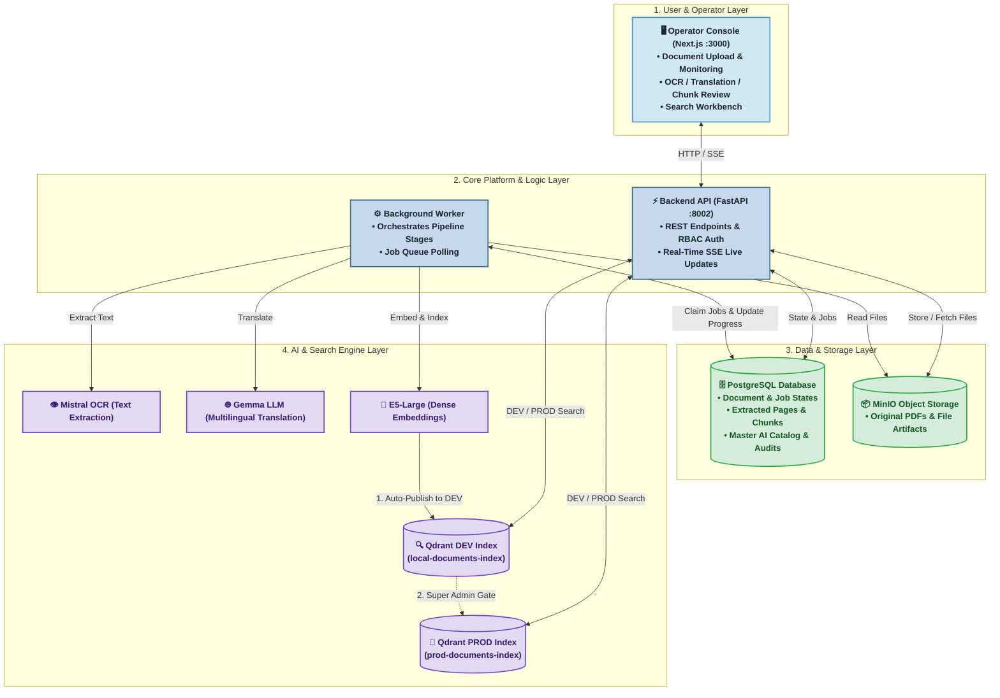
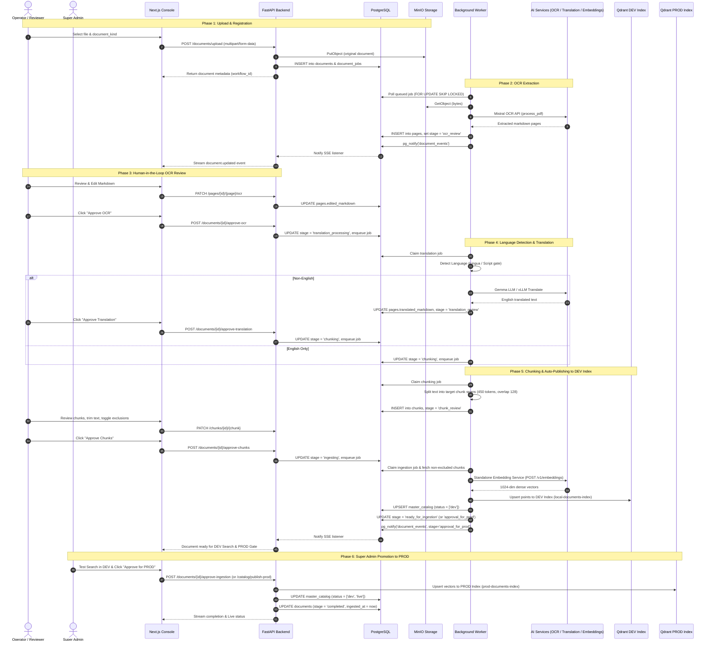
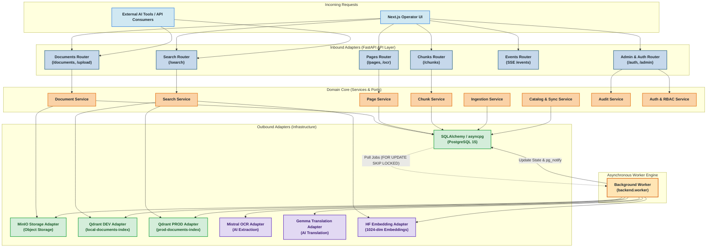

# MahaVistaar – Architecture Overview & High-Level Design

> **Executive Summary:** MahaVistaar is an enterprise document intelligence and semantic search platform. It transforms complex multilingual agricultural PDFs and guidelines into verified, searchable knowledge through automated AI extraction (OCR & Translation), human-in-the-loop review, and a two-tier publishing model (DEV Index for testing ➔ PROD Index for live applications).

---

## 1. Simplified 4-Layer Presentation Architecture



---

## 2. The 3 Core Flows (In Plain English)

### 🔹 Flow 1: Automated Ingestion & AI Extraction
```text
[ Upload PDF ] ➔ [ Mistral OCR ] ➔ [ Language Detection & Gemma Translation ] ➔ [ Semantic Chunking ]
```
1. **Upload:** User uploads a PDF via the web console.
2. **OCR Extraction:** Mistral OCR converts pages into structured markdown.
3. **Translation:** If non-English (e.g. Marathi/Gujarati), Gemma LLM translates it into English while preserving the original text.
4. **Chunking:** Content is split into clean 450-token semantic chunks with page citations.

---

### 🔹 Flow 2: Human Review & Two-Tier Publishing (DEV ➔ PROD)
```text
[ Review & Edit ] ➔ [ Auto-Publish to DEV Index ] ➔ [ Test Search in DEV ] ➔ [ Super Admin Promotes to PROD ]
```
1. **Human-in-the-Loop Review:** Reviewers can edit extracted text, refine translations, or exclude unwanted chunks.
2. **Auto-Publish to DEV Index:** Approved chunks are immediately converted into 1024-dim dense vectors and published to the **Qdrant DEV collection** (`local-documents-index`).
3. **DEV Search Testing:** Operators verify retrieval accuracy in the search playground against the DEV collection.
4. **PROD Promotion Gate:** Super Admin approves the document, promoting it to the **Qdrant PROD collection** (`prod-documents-index`) and syncing the Master Catalog for downstream AI chatbots.

---

### 🔹 Flow 3: Semantic Search Retrieval
```text
[ User Query ] ➔ [ Generate Query Embedding ] ➔ [ Qdrant Vector Match ] ➔ [ Ranked Results with Citations ]
```
1. User enters a query (*e.g., "How to apply for crop insurance subsidy?"*).
2. Backend generates a 1024-dim vector using multilingual `e5-large`.
3. Qdrant performs cosine similarity matching.
4. Returns top matching text snippets with page numbers, document names, and Marathi/English citations.

---

## 3. Technology Stack Cheat Sheet

| Technology | Layer | Purpose & Selection Rationale |
| :--- | :--- | :--- |
| **Next.js 15 (React 19)** | Frontend Console | Modern responsive UI for operator review, PDF side-by-side preview, and search. |
| **FastAPI** | Backend API | High-performance Python async API with automatic interactive Swagger docs. |
| **PostgreSQL 15** | Relational Database | Transactional source of truth for documents, stages, jobs, and live SSE event triggers (`pg_notify`). |
| **MinIO** | Object Storage | S3-compatible, on-prem storage for original PDF files and artifacts. |
| **Qdrant** | Vector Database | Ultra-fast vector search supporting two-tier collections (`DEV` vs `PROD`) and payload filters. |
| **Mistral OCR** | Vision Extraction | Best-in-class extraction for complex multi-column documents and tables. |
| **Gemma vLLM** | Translation Engine | Domain-aware Indic-to-English translation preserving agricultural terminology. |
| **E5-Large** | Text Embeddings | 1024-dimensional multilingual embeddings for cross-lingual search. |
| **Keycloak SSO** | Auth Provider | Enterprise OpenID Connect identity provider with Role-Based Access Control. |

---

## 4. End-to-End Ingestion Sequence



---

## 5. Backend Hexagonal Architecture



---

## 6. Database Models & Schema Design

### PostgreSQL Relational Tables
- **`documents`**: Document metadata, lifecycle state (`registered`, `ocr_review`, `translation_review`, `chunk_review`, `ready_for_ingestion`, `approval_for_prod`, `completed`, `failed`), tenant instance (`mh`, `gj`), document kind (`advisory`, `scheme`, `video`), and MinIO storage pointers.
- **`document_jobs`**: Asynchronous job queue (`queued`, `running`, `waiting_review`, `completed`, `failed`) consumed by `backend.worker`.
- **`pages`**: Extracted OCR markdown, human edited text, detected language, and translated markdown.
- **`chunks`**: Text chunk units, token counts, page span lineage, and boolean vector exclusion flags (`is_excluded`).
- **`master_catalog`**: Master AI catalog synchronization table holding document entries, prompt snippets, and environment status tiers (`status: ['dev']` or `status: ['dev', 'live']`).
- **`audit_logs`**: Tamper-evident log of all operator actions, stage approvals, reviews, and retries.
- **`document_index_status`**: Indexing status, target collection name, and vector count.

### Qdrant Vector Payload Schema
```json
{
  "id": "e4b2d180-60b1-4f40-8b17-0c7da79712ab",
  "vector": [0.0124, -0.0481, 0.0832, "... 1024 floats ..."],
  "payload": {
    "doc_id": "doc_694fb2193b22",
    "type": "document",
    "chunk_id": "chunk_001",
    "name": "PM_Kisan_Guidelines.pdf",
    "source": "PM Kisan Scheme Operational Manual, Page 1-3",
    "source_mr": "पीएम किसान योजना मार्गदर्शक सूचना, पृष्ठ १-३",
    "text": "The Pradhan Mantri Kisan Samman Nidhi provides financial support..."
  }
}
```

---

## 7. Security, RBAC & Failure Recovery

### Role-Based Access Control
- **`admin`**: Full operational access (Upload documents, edit OCR/translations, curate chunks, test in DEV search, trigger retries).
- **`super_admin`**: Full administration (Promote DEV documents to PROD, manage users & roles, sync Master Catalog to live AI bots).

### Stage-Specific Failure Recovery
If any stage fails due to external API errors, timeouts, or invalid formats, the document enters the `failed` stage. Dedicated idempotent endpoints allow restarting that exact stage without re-uploading the original file:
- **`POST /documents/{id}/retry-ocr`**: Restarts OCR extraction.
- **`POST /documents/{id}/retry-translation`**: Restarts language translation.
- **`POST /documents/{id}/retry-chunking`**: Restarts chunking generation.
- **`POST /documents/{id}/reingest`**: Restarts vector indexing.
- **`DELETE /documents/{id}`**: Soft-deletes document and frees resources.
