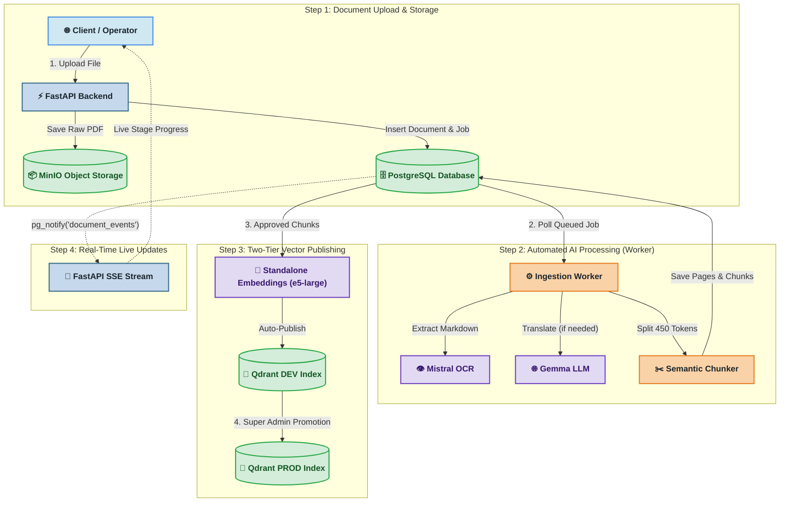

# Backend Flow & Processing Pipeline

Technical specification of the **MahaVistaar** backend architecture and processing flow.

---

## 1. Simplified Backend Flow Diagram



---

## 2. Step-by-Step Processing Breakdown

```text
[ Upload File ] ➔ [ Mistral OCR ] ➔ [ Gemma Translation ] ➔ [ Chunking ] ➔ [ DEV Index ] ➔ [ PROD Index ]
```

### 1. Document Upload (`POST /documents/upload`)
- **FastAPI** receives the multipart file upload.
- Stores the raw PDF in **MinIO** under `{instance}/{workflow_id}/{filename}`.
- Creates records in **PostgreSQL** (`documents` table with `stage='registered'` and a task in `document_jobs`).

### 2. OCR Extraction
- **Ingestion Worker** claims the job via non-blocking lock (`FOR UPDATE SKIP LOCKED`).
- Sends the PDF bytes to **Mistral OCR** to extract clean markdown for each page.
- Saves pages to the `pages` table and sets stage to `ocr_review`.

### 3. Language Translation
- Lingua detects the language of each page.
- **English:** Skips translation directly to chunking.
- **Non-English (Marathi/Gujarati):** **Gemma LLM** translates text into English and saves it to `pages.translated_markdown`.

### 4. Semantic Chunking
- Splits translated text into clean 450-token semantic chunks with page citations.
- Saves entries to the `chunks` table and sets stage to `chunk_review`.

### 5. Two-Tier Vector Publishing (DEV ➔ PROD)
- **Auto-Publish to DEV:** When chunk review is approved, **E5-Large** generates 1024-dim dense vectors and publishes them to the **Qdrant DEV Index** (`local-documents-index`).
- **PROD Promotion Gate:** Super Admin tests search in DEV and clicks *"Approve for PROD"*, promoting the vectors to the **Qdrant PROD Index** (`prod-documents-index`) and updating the Master AI Catalog for live chatbots.

### 6. Real-Time Live UI Updates
- As the worker completes each stage, it triggers PostgreSQL `pg_notify('document_events')`.
- FastAPI streams Server-Sent Events (`GET /events/documents/{id}`) to update the operator UI without page reloads.

---

## 3. Failure Recovery Handlers

If any stage fails due to network or AI model errors, the document enters `failed` state. You can restart any stage independently without re-uploading the file:

| Action | Endpoint | Behavior |
| :--- | :--- | :--- |
| **Retry OCR** | `POST /documents/{id}/retry-ocr` | Re-runs Mistral OCR extraction |
| **Retry Translation** | `POST /documents/{id}/retry-translation` | Re-runs Gemma translation |
| **Retry Chunking** | `POST /documents/{id}/retry-chunking` | Re-runs chunk generation |
| **Re-Ingest** | `POST /documents/{id}/reingest` | Re-runs embedding & vector publishing |
| **Remove** | `DELETE /documents/{id}` | Soft-deletes document & extracted data |

---

## 4. Semantic Search Query Flow

```text
[ Search Query ] ➔ [ E5-Large (Query Vector) ] ➔ [ Qdrant Cosine Match ] ➔ [ Ranked Results with Citations ]
```
1. Client sends a search request (`POST /search`).
2. Backend requests a 1024-dim query vector from the embedding service.
3. Qdrant performs cosine similarity matching across indexed chunks.
4. Returns top matching text snippets, document titles, page spans, and Marathi/English citations.
