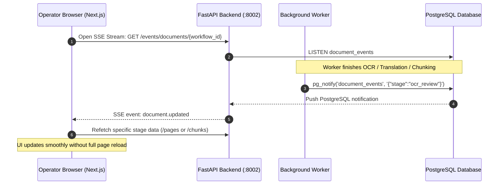

# Frontend Flow & UI Architecture

Technical specification of the **MahaVistaar** Next.js 15 operator console and human-in-the-loop review interface.

---

## 1. User & Operator Flow Diagram

```mermaid
flowchart LR
    subgraph AuthLayer["1. Authentication & Access"]
        LOGIN["🔐 Keycloak SSO / Email OTP<br/>(Role Evaluation)"]
    end

    subgraph Workspace["2. Operator Workspace"]
        DASH["📊 Dashboard<br/>(Metrics & Queue Overview)"]
        INGEST["📤 Ingest Screen<br/>(Multi-File & Kind Selection)"]
        DOCS["📑 Documents Library<br/>(Paginated State Tracking)"]
    end

    subgraph ReviewPipeline["3. Human-in-the-Loop Review Stages"]
        OCR_REV["👁️ OCR Review<br/>(Side-by-Side PDF & Markdown)"]
        TRANS_REV["🌐 Translation Review<br/>(Indic ➔ English Validation)"]
        CHUNK_REV["✂️ Chunk Curation<br/>(Text Spans & Exclusions)"]
    end

    subgraph Publishing["4. Two-Tier Publishing & Search"]
        DEV_SEARCH["🧪 DEV Search Workbench<br/>(Auto-Published Post-Chunks)"]
        PROD_GATE["🚀 PROD Promotion Gate<br/>(Super Admin Live Release)"]
    end

    LOGIN --> DASH
    DASH --> INGEST & DOCS
    INGEST -->|"Upload & Start Workflow"| OCR_REV
    OCR_REV -->|"Approve OCR"| TRANS_REV
    TRANS_REV -->|"Approve Translation"| CHUNK_REV
    CHUNK_REV -->|"Approve Chunks"| DEV_SEARCH
    DEV_SEARCH -->|"Promote to Live"| PROD_GATE

    %% Visual Styling matching reference
    classDef clientStyle fill:#D0E8F2,stroke:#4A90E2,stroke-width:2px,color:#1A252C,font-weight:bold;
    classDef apiStyle fill:#C6D8EB,stroke:#3B6E8C,stroke-width:2px,color:#1A252C,font-weight:bold;
    classDef workerStyle fill:#FAD2A7,stroke:#E67E22,stroke-width:2px,color:#1A252C,font-weight:bold;
    classDef dbStyle fill:#D4EDDA,stroke:#28A745,stroke-width:2px,color:#155724,font-weight:bold;

    class LOGIN,DASH clientStyle;
    class INGEST,DOCS apiStyle;
    class OCR_REV,TRANS_REV,CHUNK_REV workerStyle;
    class DEV_SEARCH,PROD_GATE dbStyle;
```



---

## 2. Core Frontend Screens & Responsibilities

| Screen / Route | Component Path | Primary Responsibility |
| :--- | :--- | :--- |
| **Login / Auth** | `/login` | Keycloak OpenID Connect redirect, callback handler, and email OTP verification. |
| **Dashboard** | `/` | Real-time counts across pipeline stages (`ocr_review`, `translation_review`, `chunk_review`, `completed`, `failed`). |
| **Ingest / Upload** | `/ingest` | Multi-file selection, 100 MB limit validation, `document_kind` tagging (`advisory`, `scheme`, `video`), PDF preview, and upload dispatch. |
| **Documents Library** | `/documents` | Searchable, paginated document inventory with stage filters and status badges. |
| **Document Detail** | `/documents/[workflowId]` | Integrated workspace with split-screen PDF preview, live SSE stage tracking, stage actions, and review tabs. |
| **Search Workbench** | `/search` | Semantic and hybrid vector search playground testing chunks against DEV and PROD collections. |
| **Queue & Runs** | `/queue`, `/runs` | Real-time worker task queue monitoring, execution runtimes, and failure tracking. |
| **Indexes** | `/indexes` | Vector collection health, chunk counts, and Qdrant index status inspection. |
| **Audit Logs** | `/audit` | Tamper-evident operator action log and user audit trail. |
| **User Administration**| `/users`, `/roles` | Keycloak RBAC management, role assignments, and permission inspection. |

---

## 3. Real-Time State & SSE Updates



---

## 4. Frontend-to-Backend Integration Rules

1. **Client API Utility:** All backend requests pass through `src/lib/api.ts` which automatically attaches Keycloak Bearer JWT tokens and handles 401 session expirations.
2. **Next.js API Proxying:** Requests to `/api/*` are proxied directly to the backend (`http://localhost:8002`) during development via Next.js rewrites.
3. **SSE Direct Streaming:** Live Server-Sent Events connect directly to the backend URL to bypass proxy buffering.
4. **Pagination:** List endpoints use standard `limit` and `offset` query parameters (default page size: 20).
5. **Role-Based UI Gating:** Components inspect authenticated permissions (`can_upload`, `can_review`, `can_manage_users`, `can_publish_prod`) to selectively show or disable action buttons.

---

## 5. Local Development Setup

```bash
# Navigate to frontend directory
cd frontend

# Install dependencies
npm install

# Start Next.js development server
npm run dev -- --hostname 0.0.0.0 --port 3000
```
- **Frontend URL:** [http://localhost:3000](http://localhost:3000)
- **Backend API URL:** [http://localhost:8002](http://localhost:8002)
- **Keycloak Auth URL:** [http://localhost:8181/auth](http://localhost:8181/auth)
